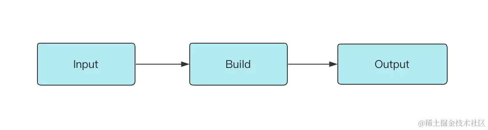
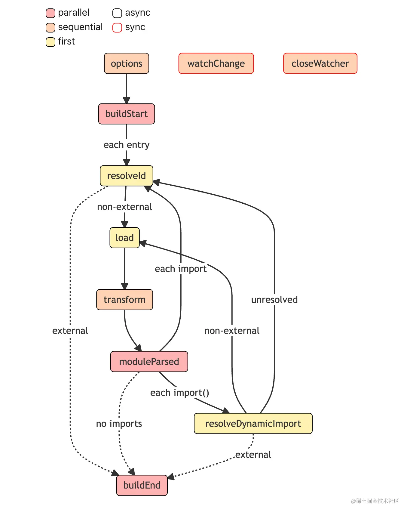

# Rollup 打包原理与插件机制

# 插件机制
Rollup 的打包过程中，会定义一套完整的构建生命周期，从开始**打包**到**产物输出**，中途会经历一些标志性的阶段，并且在不同阶段会自动执行对应的插件钩子函数 Hook。 对 Rollup 插件来讲，最重要的部分是钩子函数，一方面它定义了插件的执行逻辑，也就是 **"做什么"**；另一方面也声明了插件的作用阶段，即 **"什么时候做"**，这与 Rollup 本身的构建生命周期息息相关。

# Rollup 整体构建阶段
要真正理解插件的作用范围和阶段，首先需要了解 Rollup 整体的构建过程中到底做了些什么。

在执行 rollup 命令之后，在 cli 内部的主要逻辑简化如下：

```javascript
// Build 阶段
const bundle = await rollup.rollup(inputOptions);

// Output 阶段
await Promise.all(outputOptions.map(bundle.write));

// 构建结束
await bundle.close();
```

Rollup 内部主要经历了 Build 和 Output 两大阶段



# Build 阶段

首先，***Build 阶段主要负责创建模块依赖图*，初始化各个模块的 AST 以及模块之间的依赖关系**。 下面我们用一个简单的例子来感受一下：

```javascript
// src/index.js
import { a } from './module-a';
console.log(a);

// src/module-a.js
export const a = 1;
```

### 然后执行如下的构建脚本,以及得到的output

::: code-group 

```javascript [build]
const rollup = require('rollup');
const util = require('util');
async function build() {
  const bundle = await rollup.rollup({
    input: ['./src/index.js'],
  });
  console.log(util.inspect(bundle));
}
build();
```

```javascript [output]
{
  cache: {
    modules: [
      {
        ast: 'AST 节点信息，具体内容省略',
        code: 'export const a = 1;',
        dependencies: [],
        id: '/Users/code/rollup-demo/src/data.js',
        // 其它属性省略
      },
      {
        ast: 'AST 节点信息，具体内容省略',
        code: "import { a } from './data';\n\nconsole.log(a);",
        dependencies: [
          '/Users/code/rollup-demo/src/data.js'
        ],
        id: '/Users/code/rollup-demo/src/index.js',
        // 其它属性省略
      }
    ],
    plugins: {}
  },
  closed: false,
  // 挂载后续阶段会执行的方法
  close: [AsyncFunction: close],
  generate: [AsyncFunction: generate],
  write: [AsyncFunction: write]
}
```
:::
从上面的信息中可以看出，目前经过 Build 阶段的 bundle 对象其实并没有进行模块的打包，这个对象的作用在于存储各个模块的内容及依赖关系，同时暴露 write 和 generate 方法，用以进入到后续的 Output 阶段

# Output 阶段
真正进行打包的过程会在 Output 阶段进行，即在 bundle 对象的 write 或 generate 方法中进行。

::: code-group 

```javascript [build index.js]
const rollup = require('rollup');
async function build() {
  const bundle = await rollup.rollup({
    input: ['./src/index.js'],
  });
  const result = await bundle.generate({
    format: 'es',
  });
  console.log('result:', result);
}

build();
```

```javascript [output]
{
  output: [
    {
      exports: [],
      facadeModuleId: '/Users/code/rollup-demo/src/index.js',
      isEntry: true,
      isImplicitEntry: false,
      type: 'chunk',
      code: 'const a = 1;\n\nconsole.log(a);\n',
      dynamicImports: [],
      fileName: 'index.js',
      // 其余属性省略
    }
  ]
}

```
:::

这里可以看到，生成的 output 数组即为打包完成的结果。 当然，如果**使用 bundle.write 会根据配置将最后的产物写入到指定的磁盘目录中**。

因此，对于一次完整的构建过程而言，Rollup 会先进入到 Build 阶段，解析各模块的内容及依赖关系，然后进入 Output 阶段，完成打包及输出的过程。

对于不同的阶段，Rollup 插件会有不同的插件工作流程，接下来我们就来拆解一下 Rollup 插件在 Build 和 Output 两个阶段的详细工作流程。

# 拆解插件工作流
## 插件 Hook 的类型

首先需要了解不同插件 Hook 的类型，这些类型代表了不同插件的执行特点，是我们理解 Rollup 插件工作流的基础。

所以 Build 和 Output 这两个阶段到底跟插件机制有什么关系呢？ 实际上，插件的各种 Hook 可以根据这两个构建阶段分为两类：**Build Hook** 与 **Output Hook**。

1. Build Hook 即在 Build 阶段执行的钩子函数，在这个阶段主要进行模块代码的转换、AST 解析以及模块依赖的解析，那么**这个阶段的 Hook 对于代码的操作粒度一般为模块 module 级别，也就是单文件级别**。
2. Ouput Hook（官方称为 Output Generation Hook）则主要进行代码的打包，对于代码而言，**操作粒度一般为 chunk 级别（一个 chunk 通常指很多文件打包到一起的产物）**

# Build 阶段工作流

对于 Build 阶段，插件 Hook 的调用流程如下图所示。每个方块代表了一个 Hook。边框的颜色可以表示 Async 和 Sync 类型，方块的填充颜色可以表示 Parallel、Sequential 和 First 类型。



接下来一步步分析 Build Hooks 的工作流程：

1. 首先经历 options 钩子进行配置的转换，得到处理后的配置对象。
2. 随之 Rollup 会调用 buildStart 钩子，正式开始构建流程。
3. Rollup 先进入到 resolveId 钩子中解析文件路径（从 input 配置指定的入口文件开始）。
4. Rollup 通过调用 load 钩子加载模块内容。
5. 紧接着 Rollup 执行所有的 transform 钩子来对模块内容进行进行自定义的转换，比如 babel 转译。
6. 现在 Rollup 拿到最后的模块内容，进行 AST 分析，得到所有的 import 内容，调用 **moduleParsed** 钩子
   1. 如果是普通的 import，则执行 resolveId 钩子，继续回到步骤 3
   2. 如果是动态 import，则执行 resolveDynamicImport 钩子解析路径。如果解析成功，则回到步骤 4 加载模块；否则回到步骤 3 通过 resolveId 解析路径。
7. 直到所有的 import 都解析完毕，Rollup 执行 **buildEnd **钩子，Build 阶段结束。

::: danger
当然，在 Rollup 解析路径的时候，即执行 resolveId 或者 resolveDynamicImport 的时候，有些路径可能会被标记为 external（翻译为排除），也就是说不参加 Rollup 打包过程，这个时候就不会进行 load、transform 等等后续的处理了。
:::
