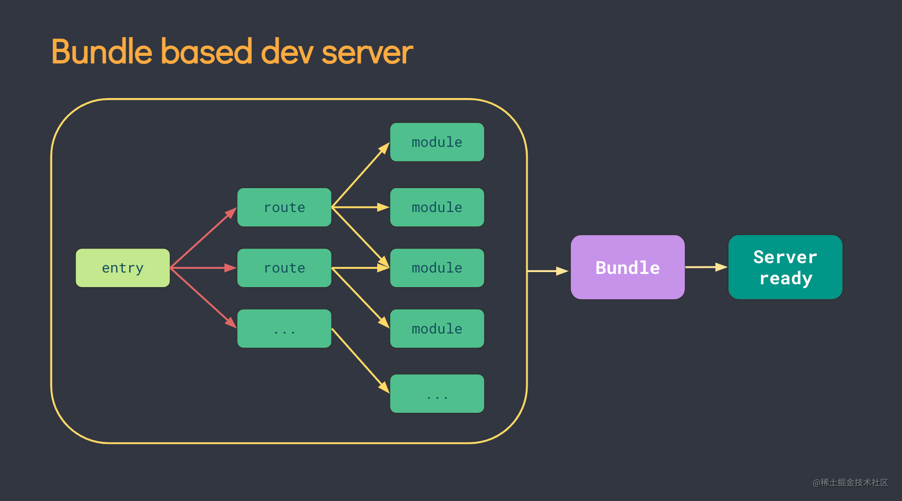
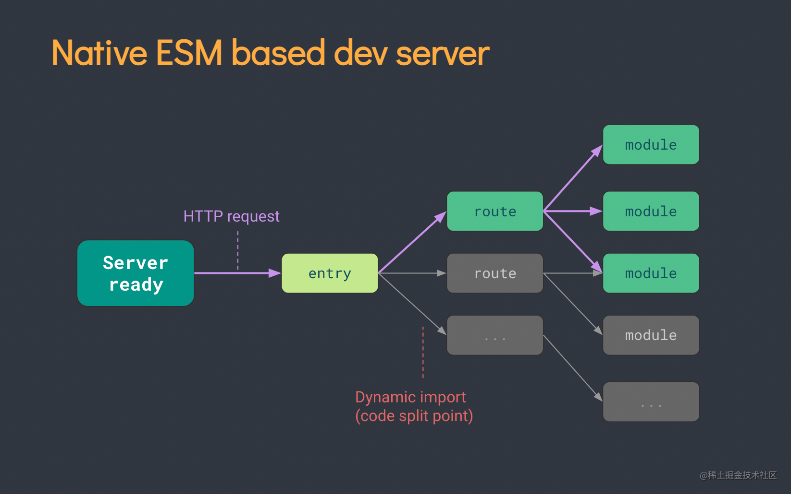
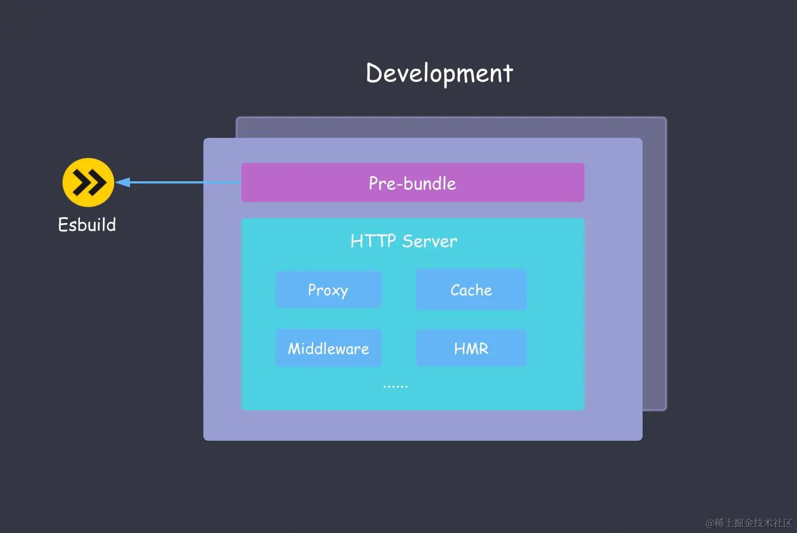

# Vite 初步理解

## 组成
> vite 是一种新型前端构建工具，能够显著提升前端开发体验。它主要由两部分组成：
> - 一个开发服务器，它基于 原生 ES 模块 提供了 丰富的内建功能，如速度快到惊人的 [模块热更新（HMR）](<https://cn.vitejs.dev/guide/features.html#hot-module-replacement/>)。
> - 一套构建指令，它使用 [Rollup](<https://rollupjs.org//>) 打包你的代码，并且它是预配置的，可输出用于生产环境的高度优化过的静态资源。

vite 主要是用于开发环境，提高我们在开发环境构建项目的速度，vite 在开发环境下使用 **ESBuild**，这个库在开发环境时进行文件编译，这个工具的性能比传统的 webpack，rollup 性能要高很多。

而在生产环境下，vite 使用 rollup 进行打包，所以其在生产环境下就相当于是 rollup。

## 区别
1. vite 本身不包含编译能力，它的编译能力是源自于 esbuild 和 rollup，它只是集成了 rollup 的功能，然后启动了 dev-server，在中间进行串联和管理

## 优势
1. 依赖预构建，将AMD，UMD，IIFE，commonjs 等转成 es module 形式，对依赖进行强缓存，并缓存在node_module/.vite下，加快服务构建。
2. 兼容 rollup 插件，vite 天生就支持所有的 rollup 插件，采用 rollup 插件的使用格式，对理解插件，建立一个插件更简单
3. 提供基于 ESM 的 HMR API，比传统的 HMR 过程更简单，反映更迅速。
4. 使用 esbuild 转译 ts，tsx，jsx，转译迅速，约是 tsc 速度的 20~30 倍。
5. 内部构建了 css 预处理器，tsx，jsx，postCss，css Module 的支持，不用用户配置，开箱即用。

## 构建方式
> Vite 通过在一开始将应用中的模块区分为 **依赖** 和 **源码** 两类，改进了开发服务器启动时间。
> - **依赖** 大多为在开发时不会变动的纯 JavaScript。一些较大的依赖（例如有上百个模块的组件库）处理的代价也很高。依赖也通常会存在多种模块化格式（例如 ESM 或者 CommonJS）。 Vite 将会使用 esbuild 预构建依赖。**Esbuild** 使用 Go 编写，并且比以 JavaScript 编写的打包器预构建依赖快 10-100 倍。
> - **源码** 通常包含一些并非直接是 JavaScript 的文件，需要转换（例如 JSX，CSS 或者 Vue/Svelte 组件），时常会被编辑。同时，并不是所有的源码都需要同时被加载（例如基于路由拆分的代码模块）。 Vite 以 原生 ESM 方式提供源码。这实际上是让浏览器接管了打包程序的部分工作：Vite 只需要在浏览器请求源码时进行转换并按需提供源码。根据情景动态导入代码，即只在当前屏幕上实际使用时才会被处理。

## Vite 架构解析

Vite 底层所深度使用的两个构建引擎：**Esbuild**和 **Rollup**

### Esbuild

作为 Bundler 打包工具，进行依赖预构建

一般来说，node_modules 依赖的大小动辄几百 MB 甚至上 GB ，会远超项目源代码，相信大家都深有体会。如果这些依赖直接在 Vite 中使用，会出现一系列的问题，这些问题我们在依赖预构建的小节已经详细分析过，主要是 ESM 格式的兼容性问题和海量请求的问题。 总而言之，对于第三方依赖，需要在应用启动前使用 Esbuild 进行**打包**并且转换为 **ESM 格式**。

